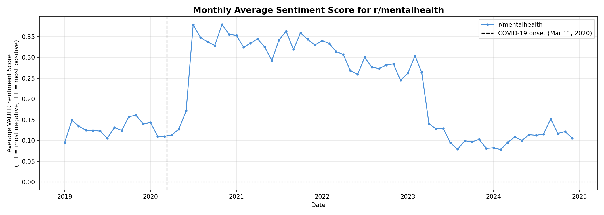
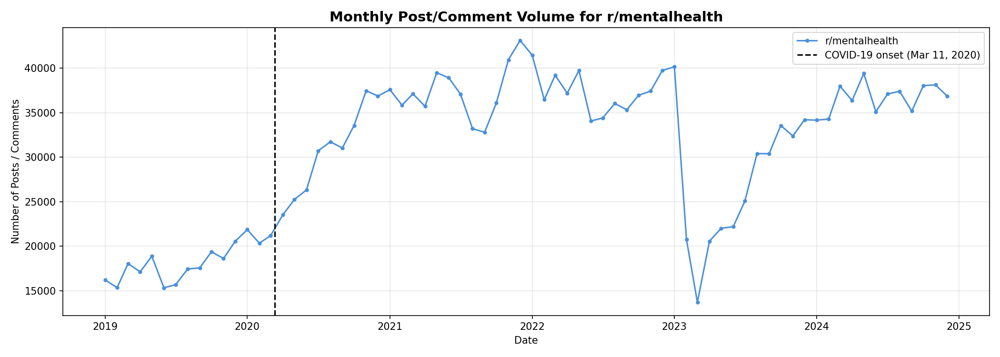
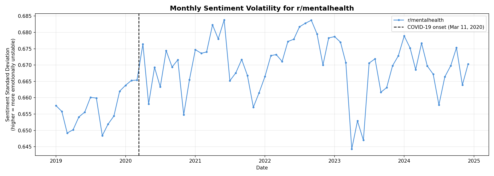
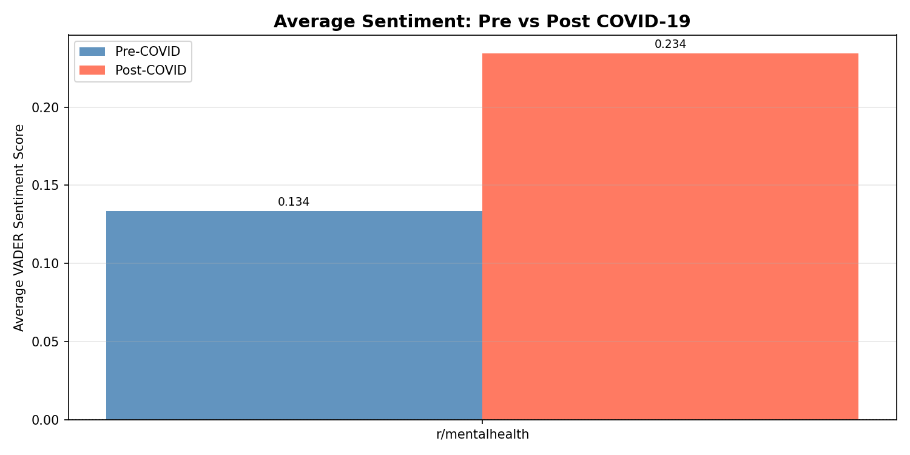

# Event-Based Mental Health Discourse Analysis on Reddit

MACS 30113 Large Scale Computing Final Project

Group members: Lu Chen, Nana Takeshiba, Anyi Li

## Table of Contents

1. [Project Overview](#project-overview)
2. [Research Questions](#research-questions)
3. [Data and Large-Scale Computing Motivation](#data-and-large-scale-computing-motivation)
4. [Repository Structure](#repository-structure)
5. [Main Results and Discussion](#main-results-and-discussion)
6. [How to Reproduce the Analysis](#how-to-reproduce-the-analysis)
7. [Individual Contributions](#individual-contributions)
8. [Limitations](#limitations)

## Project Overview

This project investigates how mental health discourse on Reddit changed around the onset of the COVID-19 pandemic. We focus on historical posts and comments from `r/mentalhealth` between January 2019 and December 2024 and build a distributed data pipeline for collecting, preprocessing, modeling, and visualizing large-scale social media text.

The project addresses a social science question at the intersection of computational sociology, public health, and online communities: how do large external shocks shape collective expressions of psychological distress, support-seeking, and peer support in online mental health spaces?

The final pipeline has three major stages:

- **Data collection:** historical Reddit posts and comments were collected from the Arctic Shift archive and written to Amazon S3 using Spark on AWS EMR.
- **Data preprocessing:** raw JSON records were cleaned, normalized, tokenized, filtered, and saved as partitioned Parquet files for downstream Spark analysis.
- **Modeling and analysis:** VADER sentiment scoring, LDA topic modeling, pre/post-COVID event-study comparisons, and visualizations were run using Spark and local plotting scripts.

The original project proposal considered several mental-health-related subreddits. For the full-data run, the group focused on `r/mentalhealth` because the complete historical dataset was already large enough for a distributed computing project and because adding multiple full subreddits would have exceeded the available AWS Academy runtime.

## Research Questions

The project asks:

- Did average sentiment in `r/mentalhealth` change after the onset of COVID-19?
- Did posting activity and emotional volatility change in the post-COVID period?
- What discussion themes appear in pre-COVID and post-COVID mental health discourse?
- How can a cloud-based distributed pipeline make large-scale Reddit text analysis more feasible than local pandas-style workflows?

We define the COVID-19 intervention point as March 2020, corresponding to the WHO pandemic declaration on March 11, 2020. Records before March 2020 are labeled `pre_covid`; records from March 2020 onward are labeled `post_covid`.

## Data and Large-Scale Computing Motivation

The final raw dataset contains:

| Data type | Records |
|---|---:|
| Posts | 603,891 |
| Comments | 1,818,218 |
| Total raw records | 2,422,109 |

After preprocessing and filtering for usable text, the main Spark NLP dataset contained about 2.2 million records from 2019-2024.

This scale motivated the use of large-scale computing methods. The project uses:

- Amazon S3 for raw and processed data storage.
- AWS EMR for Spark-based distributed computation.
- Spark DataFrames and Spark MLlib for scalable preprocessing, aggregation, and LDA topic modeling.
- Partitioned Parquet outputs for faster downstream reads.
- Aggregated CSV outputs for local visualization without downloading the full record-level dataset.

For sentiment analysis, row-level VADER scoring on the full corpus was computationally expensive under the available EMR session limits. The final sentiment/event-study analysis therefore uses a **10% reproducible random sample** of the cleaned corpus, with `seed = 42`. This sample contains 221,895 analyzed records. Topic modeling was run on the full processed corpus.

## Repository Structure

```text
.
├── 1_sentiment_analysis.ipynb
├── 2_topic_modeling.ipynb
├── 3_event_study_visualization_update.ipynb
├── 4_visualizations_local.py
├── data-processing.ipynb
├── figures/
│   ├── plot1_monthly_sentiment.png
│   ├── plot2_monthly_volume.png
│   ├── plot3_sentiment_volatility.png
│   └── plot4_pre_post_comparison.png
├── manifests/
│   └── manifest_all_2019_2024.csv
├── scripts/
│   ├── run_emr.sh
│   └── upload_project_files_to_s3.sh
└── src/
```

## Main Results and Discussion

The results and discussion in this section were developed from the modeling and visualization workflow led by Anyi. The goal was not only to produce model outputs, but also to connect the numerical patterns back to the project's social science question: how collective mental health discourse changed after the onset of COVID-19.

### Sentiment Over Time

The VADER sentiment analysis shows that average sentiment was higher in the post-COVID period than in the pre-COVID period in the analyzed sample.

| Period | Average sentiment | Sentiment volatility | Sample records |
|---|---:|---:|---:|
| Pre-COVID | 0.1308 | 0.6562 | 25,735 |
| Post-COVID | 0.2341 | 0.6798 | 196,160 |

The two-sample comparison found a statistically meaningful difference between pre- and post-COVID average sentiment:

| Pre mean | Post mean | t-statistic | Significant |
|---:|---:|---:|---|
| 0.1308 | 0.2341 | -23.6563 | Yes |

This result does not mean that mental health concerns disappeared after COVID-19. Rather, VADER scores capture lexical sentiment in the text. The post-COVID period contains many highly supportive comments and community-response language, which may raise the average compound sentiment even while the subreddit remains centered on distress, advice, and mental health support. Substantively, this suggests that `r/mentalhealth` became not only a place for expressing distress, but also a space where users increasingly responded with encouragement, resource sharing, and supportive language.



Average monthly sentiment increased sharply during parts of 2020 and 2021, peaking around late 2020. By 2023 and 2024, average sentiment returned closer to the pre-COVID range. One possible interpretation is that the early pandemic period generated both heightened need and heightened mutual support: users posted about distress, isolation, and uncertainty, while other users replied with reassurance, advice, and referrals to resources. The later decline toward pre-COVID levels may indicate that the community stabilized after the initial pandemic shock.

### Posting Volume



The volume plot uses the 10% sentiment sample, so the counts should be interpreted as sample post/comment volume rather than full-corpus volume. The pattern still shows strong growth after the beginning of the pandemic. In the sample, monthly volume reached its highest point in December 2021. This pattern supports the idea that COVID-19 was associated with increased engagement in online mental health communities. Even though the figure uses a sample, the temporal shape is informative because the sample was drawn reproducibly from the full cleaned dataset.

### Sentiment Volatility



Sentiment volatility remained high throughout the study period, which is expected in a mental health support community where highly negative self-disclosures and positive supportive replies coexist. Volatility was slightly higher in the post-COVID period. This matters because the average sentiment alone can hide the emotional range of the community: a month can have a positive mean while still containing many highly negative posts. The volatility measure helps show that the subreddit remained emotionally heterogeneous rather than simply becoming more positive.

### Pre/Post Comparison



The pre/post comparison summarizes the main event-study result: average VADER sentiment was higher in the post-COVID sample than in the pre-COVID sample. Combined with the volume and volatility plots, the result suggests a more nuanced pattern than a simple increase or decrease in distress. The community became more active after COVID-19, remained emotionally varied, and showed more positive lexical sentiment on average, likely reflecting a mixture of distress disclosure and supportive community response.

### Topic Modeling

LDA topic modeling was run separately for pre-COVID and post-COVID records using Spark MLlib. The model used 5 topics, 10 iterations, and a vocabulary cap of 5,000 terms.

Top pre-COVID topic words:

| Topic | Top words |
|---:|---|
| 0 | im, dont, people, think, like, depression, help, feel, mental, know |
| 1 | like, im, dont, ive, feel, time, know, really, things, get |
| 2 | im, like, feel, dont, get, know, people, life, even, want |
| 3 | get, people, dont, help, like, mental, one, also, know, go |
| 4 | youre, help, like, im, get, dont, thank, good, know, think |

Top post-COVID topic words:

| Topic | Top words |
|---:|---|
| 0 | someone, help, post, talk, might, please, know, like, thoughts, also |
| 1 | im, like, feel, dont, know, get, really, want, ive, time |
| 2 | please, thank, post, community, list, seeking, local, click, help, feel |
| 3 | like, dont, people, youre, feel, help, things, get, think, one |
| 4 | im, like, dont, get, ive, people, know, even, life, one |

The topics are not clean clinical categories, which is common for informal Reddit data. However, they reveal several recurring themes: personal self-disclosure, distress and help-seeking, peer support, resource sharing, and general discussion of daily emotional struggles. The post-COVID topics include more visible support and resource language, such as `please`, `thank`, `community`, `seeking`, `local`, and `help`, which is consistent with the sentiment findings: post-COVID discourse appears to include both personal struggle and stronger community response.

Dominant topic counts:

| Period | Topic 0 | Topic 1 | Topic 2 | Topic 3 | Topic 4 |
|---|---:|---:|---:|---:|---:|
| Pre-COVID | 38,293 | 39,240 | 63,507 | 32,517 | 79,472 |
| Post-COVID | 121,259 | 599,856 | 286,454 | 582,752 | 374,286 |

Taken together, the sentiment, volume, volatility, and topic results suggest that the pandemic period changed the scale and texture of discussion in `r/mentalhealth`. The subreddit became more active, retained a wide emotional range, and showed topic patterns that combine distress, help-seeking, and peer support. These findings support the broader argument that large-scale online communities can act as real-time spaces where social shocks are processed collectively through both personal disclosure and mutual aid.

## How to Reproduce the Analysis

Run the notebooks in this order:

1. `data-processing.ipynb`
   - Reads raw Reddit posts and comments from S3.
   - Cleans and tokenizes text.
   - Writes processed Parquet files to S3.

2. `1_sentiment_analysis.ipynb`
   - Reads processed Parquet files.
   - Applies VADER sentiment scoring.
   - Creates sentiment labels and writes sentiment-scored data to S3.

3. `2_topic_modeling.ipynb`
   - Reads processed Parquet files.
   - Runs LDA topic modeling for pre-COVID and post-COVID periods.
   - Saves topic-labeled data to S3.

4. `3_event_study_visualization_update.ipynb`
   - Reads sentiment-scored data.
   - Computes monthly and period-level aggregates.
   - Writes CSV outputs for local plotting.

5. `4_visualizations_local.py`
   - Reads the downloaded CSV outputs from `plot_data/`.
   - Produces the four PNG plots in `figures/`.

The local visualization script expects the downloaded Spark CSV outputs to have this layout:

```text
plot_data/
├── monthly_stats/
├── period_comparison/
└── ttest_results/
```

## Limitations

This project has several important limitations.

First, the full-data version focuses on `r/mentalhealth` only. The proposal originally discussed multiple mental-health-related subreddits, but the full historical `r/mentalhealth` corpus alone was already large enough to require distributed computation.

Second, the sentiment/event-study analysis uses a 10% reproducible sample rather than the full cleaned corpus. This choice was made because row-level VADER scoring on the full corpus was too slow for the available AWS Academy runtime and deadline. The sample is still large, with 221,895 records, but volume plots should be interpreted as sample volume rather than full-corpus volume.

Third, VADER is a lexicon-based model. It is useful for scalable social media sentiment scoring, but it cannot fully capture context, sarcasm, clinical severity, or the difference between a distressed post and a supportive reply. The sentiment results should therefore be interpreted as lexical sentiment patterns, not as clinical mental health diagnoses.

Finally, LDA topics are exploratory. They identify recurring word clusters, but they do not produce definitive psychological categories. The topic results are best read as descriptive evidence about major discussion themes in the community.


## Individual Contributions

### Lu Chen: Data Collection and Raw S3 Ingestion

Lu's contribution was the first stage of the group pipeline: collecting historical Reddit data and storing the raw data in Amazon S3 so that the rest of the group could process it with Spark. This stage focused on building a scalable ingestion workflow.

The main challenge was that Reddit data was too large to collect comfortably with a single local Python script. To make the collection process suitable for a large-scale computing project, Lu used the Arctic Shift historical Reddit API together with Spark on AWS EMR. Spark divided the collection work into monthly tasks, ran several API workers in parallel, and wrote the output directly to S3.

#### Data Scope

- Subreddit: `r/mentalhealth`
- Time period: January 2019 through December 2024
- Data types: Reddit posts and comments
- Source: Arctic Shift historical Reddit API
- Output format: line-delimited JSON written by Spark
- Final raw dataset size: 603,891 posts and 1,818,218 comments, for 2,422,109 total records

The S3 path uses `source=archive` because the earlier sample data shared with teammates already used that convention. In this project, `archive` means historical Reddit data collected from Arctic Shift rather than recent Reddit API or PRAW data.

#### Code Files

- [`src/make_manifest.py`](src/make_manifest.py): creates a manifest CSV. A manifest is a task list where each row is one collection job, such as posts from one subreddit in one month.
- [`manifests/manifest_all_2019_2024.csv`](manifests/manifest_all_2019_2024.csv): the final task list for 2019-2024. It contains 144 tasks: 72 months times 2 data types, posts and comments.
- [`src/spark_fetch_arctic.py`](src/spark_fetch_arctic.py): the main Spark/EMR collection script. It reads the manifest, calls the Arctic Shift API, retries failed requests, and writes raw JSON data to S3.
- [`scripts/upload_project_files_to_s3.sh`](scripts/upload_project_files_to_s3.sh): uploads the Spark script and manifest to S3 before running EMR.
- [`scripts/run_emr.sh`](scripts/run_emr.sh): optional helper script containing the `spark-submit` commands used for tests and full runs.

#### S3 Data Lake Layout

The raw data is stored in partitioned S3 folders so teammates can read it directly with Spark:

```text
s3://luchen-lab/raw/reddit/posts/source=archive/subreddit=mentalhealth/year=<year>/month=<month>/
s3://luchen-lab/raw/reddit/comments/source=archive/subreddit=mentalhealth/year=<year>/month=<month>/
```

Other supporting files are stored here:

```text
s3://luchen-lab/manifests/manifest_all_2019_2024.csv
s3://luchen-lab/code/spark_fetch_arctic.py
s3://luchen-lab/logs/collection_logs/
```

The output files have Spark-style names such as `part-00000-....json`. Even though the file extension is `.json`, Spark writes one JSON object per line, so the files can be read as JSONL-style data.

#### Parallel Collection Strategy

Lu developed the collection strategy iteratively. Because this pipeline depends on an external API, using more Spark cores does not always make the job faster. If too many workers call the API at the same time, the API may slow down, fail, or hit rate limits. Therefore, Lu tested several levels of parallelism before running the full dataset.

First, Lu used a conservative 4-core run on three months of data, from 2019-01 to 2019-03. This confirmed that the code, S3 output paths, logs, and retry logic worked correctly. Next, Lu tested 8 cores on another three-month window, from 2019-04 to 2019-06. The data volume was similar to the 4-core test, but the runtime was much faster, so 8 cores looked like a better setting. Lu then tested 12 cores on 2019-07 to 2019-09. This run was successful, but it was not faster than 8 cores and was close to the 4-core runtime. This suggested that the bottleneck was probably the Arctic Shift API or network requests, not Spark computation. Based on this result, the final full-data collection used 8 cores.

AWS Academy sessions can expire after about four hours, so the final collection was split into run groups. The final run groups were non-overlapping:

```text
test_4core:  2019-01 to 2019-03
test_8core:  2019-04 to 2019-06
test_12core: 2019-07 to 2019-09
full_part1:  2019-10 to 2022-04
full_part2:  2022-05 to 2024-12
```

The test runs are included in the final dataset because their months do not overlap with the full runs. This means the final dataset is the combination of all five successful run groups, without duplicate months.

#### EMR Workflow

First, Lu uploaded the code and manifest to S3:

```bash
./scripts/upload_project_files_to_s3.sh
```

Then Lu launched an EMR cluster using the course helper script:

```bash
python3 /Users/chenlu/Downloads/launch_spark_cluster.py \
    --s3_bucket luchen-lab \
    --primary_count 1 \
    --core_count 2 \
    --instance_type "m5.xlarge"
```

On the EMR primary node, Lu used `spark-submit` to run the collection. For example, this command ran the 8-core test:

```bash
spark-submit \
    --total-executor-cores 8 \
    --executor-memory 4G \
    --driver-memory 4G \
    s3://luchen-lab/code/spark_fetch_arctic.py \
    --manifest s3://luchen-lab/manifests/manifest_all_2019_2024.csv \
    --bucket luchen-lab \
    --source archive \
    --run-type test_8core \
    --run-group test_8core \
    --num-partitions 8 \
    --sleep-seconds 2 \
    --max-retries 3
```

For the longer full runs, Lu used `nohup` so that the Spark job could continue even if the SSH connection disconnected:

```bash
nohup spark-submit \
    --total-executor-cores 8 \
    --executor-memory 4G \
    --driver-memory 4G \
    s3://luchen-lab/code/spark_fetch_arctic.py \
    --manifest s3://luchen-lab/manifests/manifest_all_2019_2024.csv \
    --bucket luchen-lab \
    --source archive \
    --run-type full_part1 \
    --run-group full_part1 \
    --num-partitions 8 \
    --sleep-seconds 2 \
    --max-retries 3 \
    > full_part1.out 2>&1 &
```

After each run, the script wrote a JSON run log to S3. These logs record the number of tasks, records collected, failed tasks, runtime, and per-task details.

#### Run Results

| Run group | Time window | Executor cores | Tasks | Posts | Comments | Failed or partial tasks | Runtime |
|---|---:|---:|---:|---:|---:|---:|---:|
| `test_4core` | 2019-01 to 2019-03 | 4 | 6 | 13,322 | 41,181 | 0 | 24.8 min |
| `test_8core` | 2019-04 to 2019-06 | 8 | 6 | 14,652 | 42,027 | 0 | 14.2 min |
| `test_12core` | 2019-07 to 2019-09 | 12 | 6 | 14,460 | 41,339 | 0 | 24.6 min |
| `full_part1` | 2019-10 to 2022-04 | 8 | 62 | 261,824 | 855,878 | 0 | 3.11 hr |
| `full_part2` | 2022-05 to 2024-12 | 8 | 64 | 299,633 | 837,793 | 0 | 2.72 hr |
| **Total** | **2019-01 to 2024-12** |  | **144** | **603,891** | **1,818,218** | **0** |  |

Based on the test runs, 8 executor cores were a good choice for this API-based workload. The 12-core test did not improve runtime, most likely because the bottleneck was the external API rather than Spark computation.

#### Reliability and Rate Limits

Because this pipeline calls an external API, the goal was not to use as many cores as possible. Too much parallelism could trigger rate limits or unstable requests. Lu used a conservative setup with limited cores, `sleep_seconds=2`, and `max_retries=3`.

The manifest design also helped with reliability. If a run failed, the group could rerun only the affected `run_group` instead of restarting the entire 2019-2024 collection. Since each run group covers a different set of months, the final dataset can combine all successful runs without duplicating months.

### Nana Takeshiba: Data Cleaning, Preprocessing, and Scalable Text Processing

Code and results for this part: [`data-processing.ipynb`](data-processing.ipynb)

Nana's contribution focused on building a scalable preprocessing and exploratory analysis pipeline for large-scale Reddit mental health discussions using Apache Spark on AWS EMR.

#### Architecture and Workflow

The analysis was conducted on a Spark-enabled AWS EMR cluster accessed through JupyterHub. Reddit posts and comments from the `r/mentalhealth` community were stored on Amazon S3 and loaded directly into Spark DataFrames using distributed JSON readers. This architecture was selected because the dataset is too large for efficient local processing and can be analyzed more effectively through distributed computing.

#### Data Cleaning

The first stage of the pipeline focused on data quality control. For both posts and comments, Nana removed:

- null observations,
- deleted Reddit entries (`[deleted]`),
- removed Reddit entries (`[removed]`),
- and empty text records.

These observations do not contain meaningful textual information and would introduce noise into subsequent analyses. After cleaning, the resulting Spark DataFrames were cached in memory. Because multiple downstream analyses reuse the same cleaned datasets, caching reduces repeated computation and improves overall runtime performance.

#### Text Preprocessing

After cleaning, Nana implemented a scalable text preprocessing workflow designed to convert raw Reddit text into structured representations suitable for large-scale analysis.

The preprocessing pipeline consisted of:

1. Converting all text to lowercase to ensure consistent word matching.
2. Removing punctuation and non-alphabetic characters using regular expressions.
3. Tokenizing text into individual words.
4. Removing common stopwords using Spark MLlib's `StopWordsRemover`.
5. Creating a token-count feature (`num_tokens`) to measure text length.

This workflow was intentionally designed to balance computational efficiency and analytical usefulness. Lowercasing and punctuation removal reduce redundant vocabulary, while tokenization and stopword removal produce cleaner word-level representations for exploratory text analysis. The token-count variable additionally provides a simple measure of posting behavior and discussion complexity.

#### Exploratory Analysis and Findings

Nana conducted several scalable exploratory analyses on the processed datasets.

First, Nana performed word frequency analysis using Spark's distributed aggregation operations. By exploding token arrays and aggregating counts across the cluster, Nana identified the most frequently used terms in mental health discussions.

For posts, the most common terms included `"im"` (857,540 occurrences), `"like"` (622,341), `"feel"` (489,092), `"know"` (372,302), and `"help"` (181,246). These terms suggest that posts primarily consist of personal experiences, emotional reflections, and requests for advice or support.

For comments, the most frequent terms included `"please"` (2,004,055 occurrences), `"thank"` (658,890), `"feel"` (658,400), `"help"` (633,198), and `"therapy"` (390,660). Compared with posts, comments contained more supportive and advice-oriented language, indicating that community members actively respond to and assist one another.

Second, Nana conducted yearly aggregation analyses of posts and comments to examine how community activity evolved over time.

The number of posts increased substantially from **37,868 posts in 2019** to **106,339 posts in 2024**, indicating sustained growth in participation within the subreddit.

Similarly, comment activity expanded during the study period. The number of comments increased from **172,849 comments in 2019** to a peak of **387,720 comments in 2021**. Although comment volume declined somewhat afterward, activity remained substantially higher than pre-2020 levels, suggesting continued community engagement.

Third, Nana calculated average token counts by year to investigate temporal changes in discussion length and user engagement.

Posts remained consistently detailed throughout the observation period, averaging approximately **98-107 tokens per post**. The average post length was relatively stable across years, suggesting that users consistently provided substantial descriptions of their experiences and concerns.

Comments were shorter but exhibited greater variation. Average comment length increased from **28.7 tokens in 2019** to **43.5 tokens in 2021**, before declining to approximately **33.6 tokens in 2024**. This pattern may indicate periods of deeper interaction and more extensive discussion within the community.

All analyses were implemented using Spark transformations and aggregations, allowing them to scale efficiently to large datasets.

#### Data Storage and Scalability

To support downstream group analyses, the processed datasets were saved to Amazon S3 as partitioned Parquet files.

Nana selected the Parquet format because it is substantially more efficient than CSV for Spark workloads, providing faster read performance, columnar storage, and reduced storage requirements. The datasets were additionally partitioned by year and month to improve query efficiency and reduce unnecessary data scanning in later stages of the project.

#### Scalability Benchmarking

Finally, Nana evaluated the scalability of the workflow by running the preprocessing pipeline on multiple data fractions: 10%, 50%, and 100% samples.

The workflow completed in **3.60 seconds** for the 10% sample, **2.48 seconds** for the 50% sample, and **2.35 seconds** for the full dataset. The relatively stable runtime suggests that the distributed Spark workflow can process larger datasets without substantial increases in execution time.

Overall, Nana's contribution centered on designing a scalable text-processing infrastructure for Reddit mental health data. This pipeline transformed raw social media text into structured analytical datasets, generated descriptive insights regarding language use and community engagement, and produced reusable Parquet datasets that enabled subsequent group-level analyses.

### Anyi Li: Sentiment Analysis, Topic Modeling, Event Study, and Visualization

Anyi's contribution focused on the modeling, analysis, interpretation, and visualization layer of the project. This stage used the cleaned Spark datasets produced by the preprocessing pipeline to measure sentiment, identify topics, compare pre/post-COVID periods, produce the final figures, and write the main results discussion that connects the outputs to the research questions.

Code and results for this part:

- [`1_sentiment_analysis.ipynb`](1_sentiment_analysis.ipynb)
- [`2_topic_modeling.ipynb`](2_topic_modeling.ipynb)
- [`3_event_study_visualization_update.ipynb`](3_event_study_visualization_update.ipynb)
- [`4_visualizations_local.py`](4_visualizations_local.py)

#### Sentiment Analysis

Anyi implemented VADER sentiment scoring on the cleaned Reddit text. VADER returns a compound sentiment score from -1 to +1, where negative values indicate more negative text and positive values indicate more positive text. The notebook also converted the continuous VADER score into three labels:

- `positive`: compound score >= 0.05
- `negative`: compound score <= -0.05
- `neutral`: values between -0.05 and 0.05

Because SparkNLP and transformer-based sentiment models required additional system dependencies that were not reliable in the available EMR environment, the final pipeline used VADER as the primary method. To preserve notebook compatibility with the planned pipeline, `sparknlp_sentiment` was stored as a copy of the VADER sentiment label.

The full cleaned dataset contained over 2.2 million records, but row-level VADER scoring was expensive under the available AWS session time. Anyi therefore used a 10% reproducible random sample with `seed = 42` for the sentiment and event-study portion. This produced 221,895 scored records: 25,735 pre-COVID records and 196,160 post-COVID records.

#### Topic Modeling

Anyi implemented LDA topic modeling using Spark MLlib. The model was run separately for the pre-COVID and post-COVID periods to compare discussion themes across the event window.

The topic modeling pipeline:

1. Reads the processed Parquet files from S3.
2. Defines pre/post-COVID windows.
3. Converts filtered token arrays into sparse term-frequency vectors with `CountVectorizer`.
4. Fits LDA models separately for each period.
5. Extracts top words and dominant-topic distributions.
6. Saves topic-labeled outputs to S3.

The resulting topics show that `r/mentalhealth` discussions include personal self-disclosure, distress, help-seeking, peer support, resource sharing, and general discussion of daily emotional struggles.

#### Event-Study Aggregation and Visualization

Anyi implemented an event-study style comparison around March 2020 and designed the results workflow used in the README. The analysis computed monthly and period-level metrics:

- average VADER sentiment,
- sentiment volatility,
- post/comment volume in the analyzed sample,
- and a pre/post t-test using aggregate statistics.

The Spark notebook writes compact CSV outputs to S3 so that plotting can be done locally without downloading the full record-level dataset. The local Python script then creates four figures:

- monthly average sentiment,
- monthly sample post/comment volume,
- monthly sentiment volatility,
- and the pre/post average sentiment comparison.

This design reflects a large-scale visualization principle: aggregate in Spark first, then visualize only compact summary tables locally. Anyi also interpreted the resulting patterns, including the increase in post-COVID average sentiment, the growth in sample post/comment volume, persistent sentiment volatility, and the topic-model evidence of both distress and support-seeking language.
